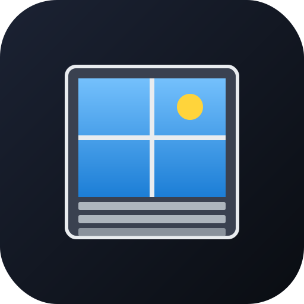

> [🇬🇧 English](README.md) | 🇩🇪 Deutsch

<p align="center">
  
</p>

# hmip-velux-plugin

📦 **[hmip-velux-plugin-1.1.1.tar.gz herunterladen](https://github.com/fabiorenner-hub/hmip-hcu-velux_klf200/releases/latest/download/hmip-velux-plugin-1.1.1.tar.gz)** — Installation in HCUweb über *Entwicklermodus → Plugins → Aus Datei installieren*.

GitHub: <https://github.com/fabiorenner-hub/hmip-hcu-velux_klf200>

Homematic IP HCU Plugin, das Velux-Geräte (Rollläden, Markisen, Fenster) über
ein **KLF-200 Gateway** in die Homematic IP App bringt.

```
HMIP App  <- cloud ->  HCU  <- wss:9001 ->  hmip-velux-plugin  <- TLS:51200 ->  KLF-200  <- io-homecontrol ->  Velux
```

Jeder vom KLF-200 gefundene Knoten wird der HCU als `WINDOW_COVERING`-Device mit
`ShutterLevel`-Feature gemeldet. Befehle aus der App (`setShutterLevel`, `stop`)
werden auf `GW_COMMAND_SEND_REQ` an das KLF-200 übersetzt, Positions-Notifications
vom KLF-200 landen als `STATUS_EVENT` bei der HCU.

## Spenden

Wenn dir dieses Plugin hilft, freue ich mich über eine kleine Spende — sie
hält bei mir die Lichter an, während ich weitere HCU-Plugins baue:
[Spenden via PayPal](https://www.paypal.com/donate/?hosted_button_id=JPZRATUUHRT5C).

## Auf der HCU installieren

Die HCU nimmt ein **ARM64-Container-Image** als `.tar.gz` entgegen.

1. Die aktuellste `hmip-velux-plugin-<version>.tar.gz` aus den
   [Releases](https://github.com/fabiorenner-hub/hmip-hcu-velux_klf200/releases)
   herunterladen.
2. In HCUweb *Einstellungen → Entwicklermodus → Plugins → Aus Datei installieren*
   öffnen und die Datei hochladen.
3. Die Plugin-Kachel öffnen → *Konfiguration* und ausfüllen:
   - **KLF-200 Hostname oder IP** (z. B. `192.168.1.50`)
   - **KLF-200 WLAN-Passwort** (steht auf der Rückseite des Gateways –
     *nicht* das Web-Konfigurations-Passwort)
   - **Node IDs** (optional; leer = alle verbundenen Velux-Geräte übernehmen)
4. Speichern. Nach wenigen Sekunden tauchen die Velux-Geräte im
   HMIP-App-Posteingang als Rollläden auf, die du Räumen zuordnen kannst.

## Selbst die Installationsdatei bauen

Du brauchst:

- **Docker Desktop** (Windows/macOS) oder **Docker Engine + buildx** (Linux)

Dann im Ordner `hmip-velux-plugin/`:

**Windows (PowerShell)**

```powershell
./build.ps1
```

**macOS / Linux**

```bash
chmod +x build.sh
./build.sh
```

Heraus kommt `hmip-velux-plugin-<version>.tar.gz`. Das Build-Skript nutzt
`buildx` mit QEMU-Emulation, sodass du auch auf einem x86-PC ein ARM64-Image
erzeugen kannst. Der Build dauert unter Emulation 2–5 Minuten.

## Voraussetzungen auf der HCU

1. Home Control Unit (HCU1) mit **Firmware 1.4.7 oder neuer**
2. In HCUweb: *Entwicklermodus* aktivieren
3. Velux **KLF-200 Gateway**, Firmware **0.2.0.0.71** oder neuer (ältere
   Versionen sprechen noch das alte LAN-Protokoll und funktionieren nicht
   mit diesem Plugin)

## Remote entwickeln (ohne Image-Build)

Während der Entwicklung kannst du das Plugin direkt auf dem Rechner starten:

1. In HCUweb im Entwicklermodus *Connect API WebSocket freigeben* aktivieren
2. Einen Auth-Token für die Plugin-ID `de.homematicip.plugin.velux` erzeugen
3. `.env` anlegen oder Variablen exportieren:

   ```env
   HMIP_HCU_HOST=hcu1-XXXX.local
   HMIP_HCU_AUTH_TOKEN=<dein-token>
   VELUX_HOST=192.168.1.50
   VELUX_PASSWORD=<wlan-passwort>
   LOG_LEVEL=debug
   ```

4. `npm install && npm run dev`

Die Plugin-Kachel in HCUweb sollte direkt auf *READY* wechseln.

## Feature-Mapping

| HMIP Feature       | Velux Mapping                                        |
| ------------------ | ---------------------------------------------------- |
| `shutterLevel`     | `CurrentPositionPct / 100` (HMIP: `1` = geschlossen) |
| `shutterDirection` | aus der letzten Positionsänderung abgeleitet         |
| `setShutterLevel`  | `GW_COMMAND_SEND_REQ` mit `rawPercent = level * 100` |
| `stop` (Control)   | `GW_COMMAND_SEND_REQ` mit Stopp-Wert `0xD200`        |

Slats (`slatsLevel`) und Wartungs-/Batteriestatus lassen sich analog über den
`device-mapper` nachrüsten.

## Bekannte Einschränkungen

- Die `velux-klf200-api` liefert bei `GW_NODE_STATE_POSITION_CHANGED_NTF` einen
  kaputten Zeitstempel – für uns egal, wir brauchen nur `NodeID` und
  `CurrentPositionPct`.
- Das KLF-200 kappt TLS nach ~15 min Idle. Der Client polled deshalb alle
  5 min mit `GW_GET_VERSION_REQ`.
- Bei aktiviertem `GW_HOUSE_STATUS_MONITOR` kann laut Velux-Issue-Tracker
  ein abruptes Trennen dazu führen, dass das KLF-200 nicht mehr erreichbar ist;
  Abhilfe ist dann nur ein Stromreset des Gateways.

## Herausgeber

Herausgegeben von **Fabio Renner**.

## Lizenz

Apache-2.0
